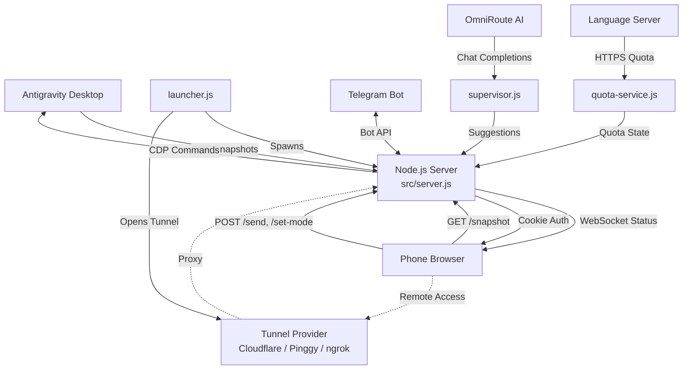

# CODE DOCUMENTATION — OmniAntigravity Remote Chat v1.3.0

## Project Structure

```text
omni-antigravity-remote-chat/
├── src/
│   ├── server.js                   # Main server (Express + WS + CDP actions, ~3400 lines)
│   ├── config.js                   # Constants, env vars, feature flags, version
│   ├── env.js                      # dotenv bootstrap (resolves .env from project root)
│   ├── state.js                    # Shared mutable state + JSDoc type definitions
│   ├── supervisor.js               # AI supervisor (OmniRoute), suggest queue, heuristic safety
│   ├── quota-service.js            # Model quota polling via language server HTTPS API
│   ├── session-stats.js            # In-memory session analytics and metrics
│   ├── screenshot-timeline.js      # Persistent screenshot capture with disk storage
│   ├── ui_inspector.js             # UI DOM inspection utilities via CDP
│   ├── cdp/
│   │   └── connection.js           # CDP discovery, WebSocket connect, context management
│   └── utils/
│       ├── network.js              # getLocalIP, isLocalRequest, getJson
│       ├── process.js              # killPortProcess, isPortFree, launchAntigravity
│       ├── hash.js                 # djb2 hash for snapshot diff detection
│       ├── telegram.js             # Telegram bot: commands, inline keyboards, rate-limiting
│       └── workspace.js            # File browser, terminal, Git, quick commands, uploads
├── public/
│   ├── index.html                  # Main mobile chat interface
│   ├── login.html                  # Authentication page
│   ├── admin.html                  # Admin panel (metrics, logs, tunnel control)
│   ├── minimal.html                # Lite mode for unstable connections
│   ├── manifest.json               # PWA manifest
│   ├── sw.js                       # Service worker for offline capability
│   ├── css/
│   │   ├── variables.css           # CSS custom properties / design tokens
│   │   ├── themes.css              # 5 theme definitions (dark, light, slate, pastel, rainbow)
│   │   ├── layout.css              # Page layout and responsive grid
│   │   ├── components.css          # Reusable UI components
│   │   ├── chat.css                # Chat-specific styling
│   │   ├── workspace.css           # Workspace panel styles
│   │   ├── assist.css              # Assist tab styles
│   │   └── style.css               # CSS import barrel
│   ├── js/
│   │   ├── app.js                  # Main client logic (WebSocket, rendering, UI state, ~49KB)
│   │   ├── admin.js                # Admin panel client logic
│   │   ├── login.js                # Login page logic (CSP-compliant)
│   │   ├── minimal.js              # Lite mode client logic
│   │   ├── theme-bootstrap.js      # Theme initialization (extracted for CSP)
│   │   ├── components/
│   │   │   ├── assist-panel.js     # Supervisor assist chat panel
│   │   │   ├── file-browser.js     # Remote file directory browser
│   │   │   ├── git-panel.js        # Git status, staging, commit, push
│   │   │   ├── stats-panel.js      # Live session analytics panel
│   │   │   ├── terminal-view.js    # Remote terminal command execution
│   │   │   └── timeline-panel.js   # Screenshot timeline viewer
│   │   └── vendor/                 # Third-party libraries (if any)
│   └── icons/
│       ├── app-icon.svg            # Standard app icon
│       └── app-icon-maskable.svg   # Maskable PWA icon
├── scripts/
│   ├── cloudflare-tunnel.js        # Cloudflare Quick Tunnel manager class
│   ├── pinggy-tunnel.js            # Pinggy SSH tunnel manager class
│   ├── generate_ssl.js             # SSL certificate generator (OpenSSL + crypto fallback)
│   ├── setup-ssl.js                # Interactive SSL setup with mkcert
│   ├── install_context_menu.sh     # Linux context menu installer
│   ├── install_context_menu.bat    # Windows context menu installer
│   ├── start.sh / start.bat        # Local launchers
│   ├── start_web.sh / start_web.bat# Remote launchers
│   ├── sync_features.py            # Feature sync utility
│   └── windows-wsl-remote/         # WSL2 PowerShell integration scripts
│       ├── Start-OmniChat.ps1      # 1-click WSL launcher
│       ├── Start-OmniChat-Ngrok.ps1# WSL + ngrok launcher
│       ├── Check-Security.ps1      # Security audit script
│       ├── config.json.example     # WSL config template
│       └── README.md               # WSL integration guide
├── test/
│   ├── test.js                     # Integration/smoke test suite
│   └── unit/                       # Vitest unit tests (9 test files)
│       ├── config.test.js          # Config module tests
│       ├── hash.test.js            # Hash utility tests
│       ├── network.test.js         # Network utility tests
│       ├── quota-service.test.js   # Quota service tests
│       ├── screenshot-timeline.test.js # Timeline tests
│       ├── session-stats.test.js   # Session stats tests
│       ├── supervisor.test.js      # Supervisor + suggest queue tests
│       ├── telegram.test.js        # Telegram integration tests
│       └── import-fresh.js         # Test helper for ESM module reloading
├── data/                           # Runtime data (gitignored)
│   ├── quick-commands.json         # Customizable quick action prompts
│   ├── screenshots/                # Timeline screenshot storage
│   └── uploads/                    # User-uploaded images
├── .github/
│   ├── workflows/                  # CI + auto-release + Docker Hub
│   ├── ISSUE_TEMPLATE/             # Bug report & feature request templates
│   └── PULL_REQUEST_TEMPLATE.md    # PR template
├── launcher.js                     # Node.js entry point (QR code, tunnel orchestration)
├── vitest.config.js                # Vitest configuration
├── Dockerfile                      # Docker support (node:22-alpine)
├── .dockerignore                   # Docker build exclusions
├── .gitleaks.toml                  # Secret scanning configuration
├── package.json                    # Dependencies, scripts, NPM metadata
├── .env.example                    # Environment template (61 lines)
├── CHANGELOG.md                    # Version history (Keep a Changelog)
├── DESIGN_PHILOSOPHY.md            # 10 core design principles
├── SECURITY.md                     # Security model and HTTPS guide
├── CONTRIBUTING.md                 # Contribution guidelines
├── CODE_OF_CONDUCT.md              # Contributor Covenant v2.1
├── README.md                       # Main setup guide
└── README.*.md                     # 29 language translations
```

## High-Level Architecture

The system acts as a "Mobile Command Center" for Antigravity AI sessions. It utilizes the **Chrome DevTools Protocol (CDP)** to bridge a local Antigravity instance and a remote mobile browser, adding workspace tools, AI supervision, quota monitoring, and multi-provider tunnel access.

### Data Flow



### Port Mapping

| Port         | Purpose                    | Configurable                   |
| :----------- | :------------------------- | :----------------------------: |
| **7800-7803** | Antigravity CDP debug ports | `CDP_PORTS` in `.env`          |
| **4747**     | OmniAntigravity web server | `PORT` in `.env`               |

## Core Modules

### src/config.js — Configuration Hub

Single source of truth for all constants, environment variables, and feature flags.

| Export                      | Description                                         |
| :-------------------------- | :-------------------------------------------------- |
| `PROJECT_ROOT`              | Resolved path one level up from `src/`              |
| `PORTS`                     | CDP ports array (default: `[7800, 7801, 7802, 7803]`) |
| `CONTAINER_IDS`             | Chat container ID fallback chain                    |
| `EXCLUDED_TARGET_TITLES`    | CDP targets to ignore (launchpad, settings)         |
| `SERVER_PORT`               | Express listening port                              |
| `POLL_INTERVAL`             | Snapshot polling interval (1000ms)                  |
| `CDP_CALL_TIMEOUT`          | CDP call timeout (30s)                              |
| `JSON_BODY_LIMIT`           | Express body parser limit (15mb)                    |
| `AUTO_TUNNEL_PROVIDER`      | Auto-start tunnel on boot                           |
| `APP_PASSWORD`, `COOKIE_SECRET`, `AUTH_SALT` | Auth credentials  |
| `getSupervisorSuggestMode()`| Runtime suggest-mode flag                           |
| `getQuotaEnabled()`         | Runtime quota polling flag                          |
| `getScreenshotEnabled()`    | Runtime screenshot timeline flag                    |
| `VERSION`                   | Current version string (`1.3.0`)                    |

### src/env.js — Environment Bootstrap

Resolves `.env` from the project root directory (not `cwd`), ensuring correct behavior with `npx` and global installs.

### src/state.js — Shared State & Type Definitions

Manages shared mutable state with JSDoc `@typedef` for:
- `CDPConnection` — WebSocket, contexts, call/on/off methods
- `CDPTarget` — Multi-window target metadata
- `Snapshot` — DOM HTML, CSS, scroll info, stats

Provides explicit setter functions for safe state mutation across ES modules.

### src/supervisor.js — AI Supervisor

OmniRoute-backed local AI supervisor for safe command evaluation.

| Class / Export                | Description                                              |
| :--------------------------- | :------------------------------------------------------- |
| `AISupervisor`               | Main supervisor: remote decision, chat, assist history   |
| `SuggestQueue`               | Bounded FIFO queue with TTL, dedup, pub/sub              |
| `suggestQueue`               | Singleton queue instance                                 |
| `extractPendingCommand(html)`| Extract command text from pending-action snapshot         |
| `evaluateCommandHeuristics()`| Conservative heuristic safety gate (risky/safe patterns) |

The supervisor supports two modes:
1. **Auto-approve** — Heuristic + OmniRoute analysis → automatic accept for safe commands
2. **Suggest mode** — Queue suggestions for manual review before execution

### src/quota-service.js — Quota Monitoring

Discovers running `language_server` processes, probes their HTTPS status endpoints, and normalizes quota data.

| Export                        | Description                                           |
| :---------------------------- | :---------------------------------------------------- |
| `QuotaService`                | Main class: discover, probe, refresh, alert, poll     |
| `quotaService`                | Singleton service instance                            |
| `MODEL_NAMES`                 | Human-readable model name mapping                     |
| `normalizeQuotaPayload()`     | Normalize raw quota response into standard format     |
| `discoverLanguageServerProcesses()` | Cross-platform process discovery (Linux/Windows) |
| `buildQuotaBar()`             | Visual usage bar generator                            |

### src/session-stats.js — Session Analytics

In-memory metrics tracking with pub/sub.

| Tracked Metrics              |
| :--------------------------- |
| `messagesSent`, `quickCommandUses`, `snapshotsProcessed`, `snapshotUpdatesBroadcast` |
| `actionsApproved`, `actionsRejected`, `actionsAutoApproved` |
| `errorsDetected`, `dialogErrorsDetected`, `rateLimitHits` |
| `telegramNotificationsSent`, `quotaWarnings`, `reconnections` |
| `suggestionsCreated`, `suggestionsApproved`, `suggestionsRejected` |
| `screenCaptures`, `timelineCaptures`, `screenStreamsStarted`, `screenStreamsStopped` |
| `uploadsInjected` |

### src/screenshot-timeline.js — Screenshot Timeline

Persistent screenshot capture system with disk storage, manifest tracking, and change-aware auto-capture.

- Stores images in `data/screenshots/` with a `timeline.json` manifest
- Supports manual and automatic (interval-based) captures
- Deduplicates by snapshot hash to avoid redundant storage
- Configurable max entries with automatic pruning
- Pub/sub for real-time WebSocket state broadcasts

### src/utils/ — Utility Modules

| Module         | Key Exports                                           | Description                                      |
| :------------- | :---------------------------------------------------- | :----------------------------------------------- |
| `network.js`   | `getLocalIP`, `isLocalRequest`, `getJson`             | IP detection, local network check, HTTP helper   |
| `process.js`   | `killPortProcess`, `isPortFree`, `launchAntigravity`  | Port management, Antigravity instance launching  |
| `hash.js`      | `hashString`                                          | djb2 hash for snapshot change detection          |
| `telegram.js`  | `sendTelegramNotification`, `initTelegramBot`, `registerTelegramHooks`, `sendTypedNotification`, `sendActionRequired`, `sendSuggestionRequired` | Full Telegram bot with commands, keyboards, rate-limiting |
| `workspace.js` | `listWorkspace`, `readWorkspaceFile`, `getGitSummary`, `gitAdd`, `gitCommit`, `gitPush`, `terminalManager`, `loadQuickCommands`, `saveQuickCommands`, `saveUploadedImage` | Remote workspace tools |

### src/cdp/connection.js — CDP Connection

| Function           | Description                                                        |
| :----------------- | :----------------------------------------------------------------- |
| `discoverCDP()`    | Scans configured ports to find first Antigravity workbench target |
| `discoverAllCDP()` | Returns ALL CDP workbench targets across all ports (multi-window) |
| `connectCDP(url)`  | Establishes CDP WebSocket with pending calls map and timeout      |
| `initCDP()`        | Orchestrates discovery → connection → context registration        |

### src/server.js — Server & CDP Action Functions

| Function                   | Description                                                                         |
| :------------------------- | :---------------------------------------------------------------------------------- |
| `captureSnapshot()`        | Injects JS to clone chat DOM, extract CSS, enrich interactive elements             |
| `checkErrorDialogs()`      | Scans all CDP contexts for error/quota/rate-limit dialogs                          |
| `injectMessage()`          | Locates input field and simulates typing/submission via CDP                         |
| `setMode()` / `setModel()` | Text-based selectors to change AI settings remotely                                |
| `clickElement()`           | Deterministic targeting with occurrence index + leaf-node filtering                 |
| `remoteScroll()`           | Syncs phone scroll position to Desktop chat container                              |
| `stopGeneration()`         | Stops current AI generation via cancel button                                      |
| `completePendingAction()`  | Executes accept/reject on pending CLI action                                       |
| `getAppState()`            | Syncs Mode/Model status and detects history visibility                             |
| `startNewChat()`           | Triggers "New Chat" action on Desktop                                              |
| `getChatHistory()`         | Scrapes Antigravity history panel for conversations                                |
| `selectChat()`             | Switches desktop session to specific conversation                                  |
| `hasChatOpen()`            | Verifies if editor and chat container are rendered                                 |
| `startScreencast()`        | Starts CDP Page.screencastFrame streaming                                          |
| `stopScreencast()`         | Stops active screencast                                                            |
| `startPolling()`           | Background loop with change detection, error scanning, notifications               |
| `createServer()`           | Creates Express app with HTTP/HTTPS detection, auth, CSP, routes                   |

## API Endpoints

### Authentication & Health

| Endpoint         | Method | Description                                       |
| :--------------- | :----- | :------------------------------------------------ |
| `/login`         | POST   | Authenticates user and sets session cookie        |
| `/logout`        | POST   | Clears session cookie                             |
| `/health`        | GET    | Server status, CDP connection state, uptime       |
| `/ssl-status`    | GET    | HTTPS status and certificate info                 |
| `/generate-ssl`  | POST   | Generates SSL certificates via API                |

### Chat Control

| Endpoint         | Method | Description                                       |
| :--------------- | :----- | :------------------------------------------------ |
| `/snapshot`      | GET    | Latest captured HTML/CSS snapshot                 |
| `/send`          | POST   | Sends a message to the Antigravity chat           |
| `/stop`          | POST   | Stops current AI generation                       |
| `/set-mode`      | POST   | Changes mode to Fast or Planning                  |
| `/set-model`     | POST   | Changes the AI model                              |
| `/app-state`     | GET    | Current Mode and Model status                     |
| `/new-chat`      | POST   | Starts a new chat session                         |
| `/chat-history`  | GET    | List of recent conversation titles                |
| `/select-chat`   | POST   | Switches to a selected conversation               |
| `/chat-status`   | GET    | Status of chat container and editor               |

### CDP & Multi-Window

| Endpoint              | Method | Description                                  |
| :-------------------- | :----- | :------------------------------------------- |
| `/cdp-targets`        | GET    | Lists all available CDP targets              |
| `/select-target`      | POST   | Switches active CDP connection               |
| `/api/launch-window`  | POST   | Spawns new Antigravity instance              |
| `/remote-click`       | POST   | Triggers click on Desktop element            |
| `/remote-scroll`      | POST   | Syncs scroll position to Desktop             |

### Supervisor & Suggestions

| Endpoint                          | Method | Description                          |
| :-------------------------------- | :----- | :----------------------------------- |
| `/api/interact-action`            | POST   | Accept/reject pending action         |
| `/api/suggestions`                | GET    | List all suggestions                 |
| `/api/suggestions/pending`        | GET    | List pending suggestions with count  |
| `/api/suggestions/:id/approve`    | POST   | Approve a queued suggestion          |
| `/api/suggestions/:id/reject`     | POST   | Reject a queued suggestion           |
| `/api/suggestions`                | DELETE | Clear all suggestions                |

### Workspace

| Endpoint                   | Method | Description                              |
| :------------------------- | :----- | :--------------------------------------- |
| `/api/fs/ls`               | GET    | List workspace directory contents        |
| `/api/fs/cat`              | GET    | Read a workspace file                    |
| `/api/terminal/history`    | GET    | Get terminal output history              |
| `/api/terminal/run`        | POST   | Execute a command in the terminal        |
| `/api/terminal/stop`       | POST   | Kill the running command                 |
| `/api/git/status`          | GET    | Git status summary                       |
| `/api/git/add`             | POST   | Stage files                              |
| `/api/git/commit`          | POST   | Create a commit                          |
| `/api/git/push`            | POST   | Push to remote                           |
| `/api/quick-commands`      | GET    | List quick command prompts               |

### Analytics & Monitoring

| Endpoint                   | Method | Description                              |
| :------------------------- | :----- | :--------------------------------------- |
| `/api/stats`               | GET    | Session statistics summary               |
| `/api/quota`               | GET    | Model quota status                       |
| `/api/timeline`            | GET    | Screenshot timeline entries              |
| `/api/timeline/:filename`  | GET    | Serve a specific screenshot              |
| `/api/timeline/capture`    | POST   | Capture a manual screenshot              |
| `/api/timeline`            | DELETE | Clear all timeline entries               |

### Assist

| Endpoint                   | Method | Description                              |
| :------------------------- | :----- | :--------------------------------------- |
| `/api/assist/chat`         | POST   | Chat with the AI supervisor              |
| `/api/assist/history`      | GET    | Get assist conversation history          |
| `/api/assist/history`      | DELETE | Clear assist history                     |

### Screencast & Media

| Endpoint                   | Method | Description                              |
| :------------------------- | :----- | :--------------------------------------- |
| `/api/screencast/status`   | GET    | Current screencast streaming status      |
| `/api/screencast/start`    | POST   | Start live Page.screencastFrame          |
| `/api/screencast/stop`     | POST   | Stop active screencast                   |
| `/api/upload-image`        | POST   | Upload an image from mobile              |

### Admin

| Endpoint                       | Method | Description                           |
| :----------------------------- | :----- | :------------------------------------ |
| `/admin`                       | GET    | Admin panel HTML page                 |
| `/api/admin/logs`              | GET    | Server console logs (last N entries)  |
| `/api/admin/metrics`           | GET    | Runtime metrics and health summary    |
| `/api/admin/quick-commands`    | PUT    | Update quick command prompts          |
| `/api/admin/tunnel`            | GET    | Current tunnel status                 |
| `/api/admin/tunnel/start`      | POST   | Start a tunnel (provider selectable)  |
| `/api/admin/tunnel/stop`       | POST   | Stop the active tunnel                |

### Debug

| Endpoint         | Method | Description                                       |
| :--------------- | :----- | :------------------------------------------------ |
| `/debug-ui`      | GET    | Serialized UI tree for debugging                  |
| `/ui-inspect`    | GET    | Detailed button and icon metadata                 |
| `/minimal`       | GET    | Lite mode page                                    |

## Security & Authentication

### Content Security Policy (CSP)

Strict CSP enforced via both HTTP header and HTML meta tags:
- `script-src 'self'` — No inline scripts allowed
- `frame-src 'none'`, `object-src 'none'` — No embedding
- Font sources whitelisted for Google Fonts and cdnjs
- All inline scripts extracted to external files for compliance

### Password Protection

- **Session Management**: Signed, `httpOnly` cookies via `omni_ag_auth`
- **LAN Auto-Auth**: Local network IPs are auto-exempted for convenience
- **WebSocket Auth**: Credentials verified during handshake
- **Configurable**: `APP_PASSWORD`, `COOKIE_SECRET`, `AUTH_SALT` via `.env`

### Tunnel Security

- **Multi-provider**: Cloudflare, Pinggy, ngrok — automatic fallback
- **Magic Links**: QR includes auth key for zero-typing phone login
- **Provider isolation**: Starting one provider automatically stops others

## Tunnel System

### Supported Providers

| Provider     | Binary         | Auth Required       | Persistent URLs |
| :----------- | :------------- | :------------------ | :-------------- |
| Cloudflare   | `cloudflared`  | No (Quick Tunnels)  | No              |
| Pinggy       | `ssh`          | Optional token      | With token      |
| ngrok        | `@ngrok/ngrok` | `NGROK_AUTHTOKEN`   | With paid plan  |

### Tunnel Lifecycle

1. `launcher.js` starts the server, then requests tunnel via `/api/admin/tunnel/start`
2. `tunnelManagers` map manages provider instances with stop-other-on-start logic
3. Tunnel status is broadcast to all mobile clients via WebSocket
4. `AUTO_TUNNEL_PROVIDER` env var enables auto-start without the launcher

## Testing

### Smoke Tests (`npm test`)

`test/test.js` runs integration checks: file structure validation, module syntax, import verification.

### Unit Tests (`npm run test:unit`)

9 Vitest test files covering:
- `config.test.js` — Environment variable parsing, boolean/int readers
- `hash.test.js` — Hash function determinism
- `network.test.js` — IP detection, local request checks
- `supervisor.test.js` — Heuristic evaluation, suggestion queue operations
- `telegram.test.js` — Notification formatting, toggle logic
- `session-stats.test.js` — Metric tracking and summaries
- `quota-service.test.js` — Payload normalization, model name mapping
- `screenshot-timeline.test.js` — Capture, pruning, manifest persistence

### Coverage

V8 coverage via `npm run test:coverage`, covering: `config.js`, `quota-service.js`, `screenshot-timeline.js`, `supervisor.js`, `session-stats.js`, `utils/hash.js`, `utils/network.js`, `utils/telegram.js`.

## Dependencies

### Production

| Package           | Purpose                      |
| :---------------- | :--------------------------- |
| express 4.22      | HTTP/HTTPS server            |
| ws 8.x            | WebSocket real-time updates  |
| compression 1.8   | GZIP response compression    |
| cookie-parser 1.4 | Cookie-based auth sessions   |
| dotenv 17.3       | Environment variable loading |
| qrcode-terminal   | Terminal QR code display     |

### Development

| Package              | Purpose                  |
| :------------------- | :----------------------- |
| vitest 4.x           | Unit test runner         |
| @vitest/coverage-v8  | V8 code coverage         |

### Optional (not in package.json)

| Package                 | Purpose                        |
| :---------------------- | :----------------------------- |
| `node-telegram-bot-api` | Telegram bot (lazy-loaded)     |
| `@ngrok/ngrok`          | ngrok tunnel (lazy-loaded)     |

## CI Pipeline

GitHub Actions runs on every push/PR:
- **Test Matrix**: Node.js 22, 24
- **Syntax Checks**: `node --check` on all source files
- **Smoke Suite**: Full validation (`npm test`)
- **Unit Tests**: Vitest suite (`npm run test:unit`)
- **Auto-Release**: Version bump triggers GitHub Release + NPM publish
- **Docker Hub**: Automated image builds on release
